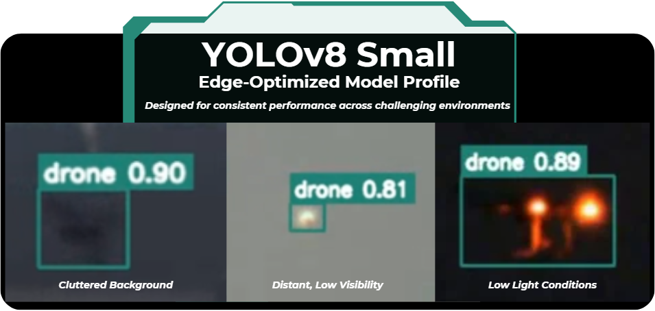
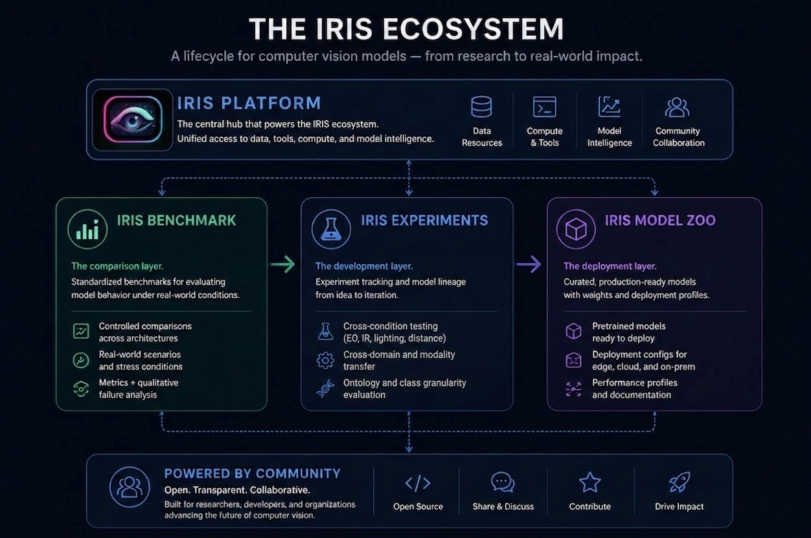

<!-- ===================================================== -->
<!--                     HEADER                            -->
<!-- ===================================================== -->

<h1 align="center">IRIS Model Zoo</h1>

  <strong>Validated Models. Real-World Deployment.</strong>

  Curated computer vision models evaluated through controlled benchmarks and experiments.

  <a href="#available-models">Browse Models</a> •
  <a href="#model-structure">Model Structure</a> •
  <a href="#how-this-fits-into-iris">Ecosystem</a>

---

  

---

<!-- ===================================================== -->
<!--                     BADGES                            -->
<!-- ===================================================== -->

  
  
  
  

---

<!-- ===================================================== -->
<!--                 WHAT THIS IS                          -->
<!-- ===================================================== -->

## What This Repository Is

This repository is the **deployment layer** of IRIS.

It provides access to models that have been:
- evaluated under controlled benchmark conditions  
- tested across real-world scenarios  
- refined through structured experimentation  

Each model represents a validated point in the IRIS lifecycle.

---

<!-- ===================================================== -->
<!--                 WHY IT EXISTS                         -->
<!-- ===================================================== -->

## Why This Exists

Most model repositories provide weights without context.

They do not show:
- how models behave under real-world conditions  
- how they compare to alternative architectures  
- what tradeoffs exist between performance and reliability  

IRIS Model Zoo focuses on:
- **validated models, not isolated weights**  
- **deployment-ready configurations**  
- **traceability back to experiments and benchmarks**  

---

<!-- ===================================================== -->
<!--                 AVAILABLE MODELS                      -->
<!-- ===================================================== -->

## Available Models

<table>
  <tr>
    <th>Model</th>
    <th>Use Case</th>
    <th>Architecture</th>
    <th>Profile</th>
    <th>Link</th>
  </tr>
  <tr>
    <td><strong>IRIS-Drone-YOLOv8s</strong></td>
    <td>Drone Detection (EO)</td>
    <td>YOLOv8s</td>
    <td>Edge-optimized</td>
    <td><a href="#">View</a></td>
  </tr>
  <tr>
    <td><strong>IRIS-Drone-RTDETR-L</strong></td>
    <td>Drone Detection (EO)</td>
    <td>RT-DETR Large</td>
    <td>High-recall</td>
    <td><a href="#">View</a></td>
  </tr>
</table>

---

<!-- ===================================================== -->
<!--               WHAT THESE MODELS REPRESENT             -->
<!-- ===================================================== -->

## What These Models Represent

Each model in this repository is the result of:

- controlled comparison across architectures  
- evaluation under real-world conditions  
- iteration through structured experiments  

These models are not selected based on a single metric.

They are selected based on how they behave under operational conditions.

---

<!-- ===================================================== -->
<!--                 MODEL STRUCTURE                       -->
<!-- ===================================================== -->

## Model Structure

Each model includes:

- pretrained weights  
- deployment configuration  
- performance characteristics  
- documentation of behavior and limitations  

Models are designed to be deployable across:
- edge environments  
- cloud systems  
- on-premise infrastructure  

---

<!-- ===================================================== -->
<!--                 DEPLOYMENT CONTEXT                    -->
<!-- ===================================================== -->

## Deployment Considerations

Model selection should be based on:

- environment (EO, IR, mixed modalities)  
- object scale and distance  
- tolerance for false positives vs missed detections  
- compute constraints  

Two models with similar metrics may behave very differently in deployment.

Understanding those differences is critical.

---

<!-- ===================================================== -->
<!--                HOW THIS FITS INTO IRIS                -->
<!-- ===================================================== -->

## How This Fits Into IRIS

IRIS is structured as a lifecycle for understanding and deploying computer vision systems.

**Flow:**

- **Benchmark** → compare model behavior under controlled, real-world conditions  
- **Experiments** → explore how models behave across changing conditions, domains, and definitions  
- **Model Zoo** → deploy models validated through this process  

  

---

<!-- ===================================================== -->
<!--                RELATED REPOS                          -->
<!-- ===================================================== -->

## Related Repositories

- **IRIS Benchmark**  
  Structured evaluation and comparison  
  → [[Benchmarks](https://github.com/iris-computer-vision/iris-benchmark)]

- **IRIS Experiments**  
  Experiment lineage and model evolution  
  → [[Experiments](https://github.com/iris-computer-vision/iris-experiments/)]

---

<!-- ===================================================== -->
<!--                EXTERNAL LINKS                         -->
<!-- ===================================================== -->

## External Resources

Check out the [IRIS](https://iriscomputervision.ai/) webpage for all the latest news and updates!
- Hugging Face Models → [Link]  
- IRIS Platform → [Link]  
- Case Studies → [Link]

---

  <strong>IRIS is built for lifecycle-driven computer vision.</strong>

